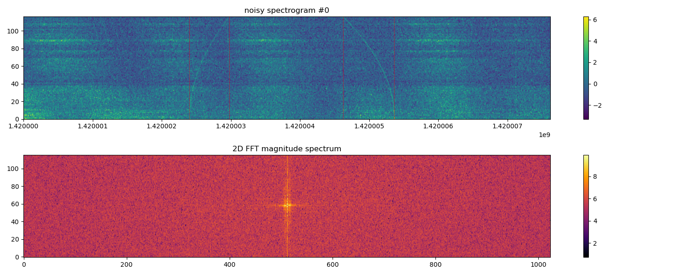

# MultiDWTNet

[](https://www.python.org/downloads/)
[](https://pytorch.org)

Multi-Scale Wavelet U-Net (MSWUNet) is a deep-learning project that implements **MSWUNet**, a hybrid model tailored for dynamic-spectrum *
*denoising** and **radio-frequency interference (RFI) detection**. By seamlessly combining 2-D Discrete Wavelet
Transforms (DWT/IDWT) with U-Net, MSWUNet captures and reconstructs multi-scale features
from time–frequency data with exceptional fidelity.

> ✅ **Link Status**: Repository successfully
> resolved — [Riko-Neko/MSWUNet](https://github.com/Riko-Neko/MSWUNet).

---

## 🔒 Model Code

🚧 Due to the ongoing submission of related research, the core model implementation is currently not included in this
repository.
👉 Stay tuned!

---

## Key Features

- **Hybrid Architecture**  
  Residual blocks + DWT/IDWT + DenseBlocks for powerful feature extraction and reconstruction.

- **Dual Outputs**  
  Simultaneously produces
    1. Denoised dynamic spectra
    2. RFI masks for anomaly detection.

- **Synthetic Data Engine**  
  Uses [**setigen**](https://setigen.readthedocs.io) to generate realistic dynamic spectra with controllable signals,
  noise, and RFI—perfect for **radio astronomy** and **SETI**.

- **Flexible Training**  
  Adaptive loss functions, built-in checkpointing, and easy hyper-parameter tuning for long-running experiments.

---

## Showcase

- **Data simulated**

| Type        | Image                            |
|-------------|----------------------------------|
| Noisy Input |   |
| Clean Input |  |

- **Example working effect**

<p align="center">
  
  
  
</p>
*The five-layer visualization includes (from top to bottom): clean simulation, noisy input, interference mask, denoised
output, and the final generated map.*


---

## Model Architecture

| Component                                | Description                                                 |
|------------------------------------------|-------------------------------------------------------------|
| **Encoder**                              | Residual blocks + DWT down-sampling (LP & HP coefficients). |
| **Bottleneck**                           | Depth-wise separable convolutions for deeper feature maps.  |
| **Decoder (Dual-Branch)**                |                                                             |
| &nbsp;&nbsp;&nbsp;&nbsp;Denoising Branch | IDWT + residual blocks → clean spectrum.                    |
| &nbsp;&nbsp;&nbsp;&nbsp;RFI Mask Branch  | Dense blocks + up-sampling → pixel-wise RFI mask.           |

---

## Dataset

Synthetic dynamic spectra generated on-the-fly via the `setigen` library.  
Configure signals, background noise, and RFI patterns in `SETIdataset.py` (`DynamicSpectrumDataset` class).

---

## Quick Start

### 1. Prerequisites

```bash
Python >= 3.8
PyTorch >= 1.10
setigen
torch-wavelets
numpy, matplotlib, tqdm
```

### 2. Installation

```bash
# Clone repo
git clone https://github.com/Riko-Neko/MultiDWTNet.git
cd MultiDWTNet

# Install deps
pip install -r requirements.txt
```

> If `requirements.txt` is missing, install packages manually.

### 3. Run

```bash
# Training
python main.py

# Inference / visualization
python pred.py
```

---

## Scripts

| File      | Purpose                                                 |
|-----------|---------------------------------------------------------|
| `main.py` | End-to-end training, validation, checkpointing.         |
| `pred.py` | Load trained weights, generate predictions, save plots. |

---

## License

*Coming soon...*

---

## Citation

If you use this project in your research, please cite:

```
@misc{DWTNet,
  title={Coming soon...},
  author={Coming soon...},
  year={2025},
  howpublished={\url{Coming soon...}}
}
```

---
Please enjoy ! 🌌
